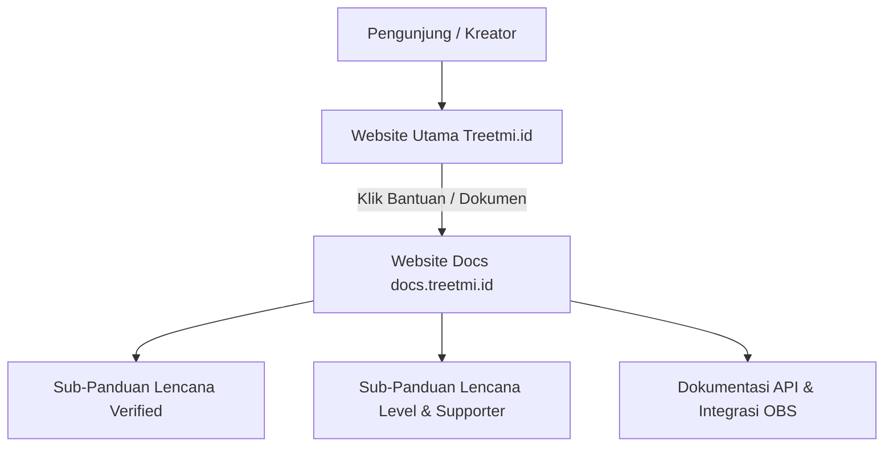

# Panduan Rencana Isi Dokumentasi (Docs) - Treetmi.id

Dokumen ini disusun sebagai blueprint panduan bagi kreator dan penonton pada platform **Treetmi.id**, yang kelak akan dihosting pada website khusus dokumentasi terpisah (misalnya `docs.treetmi.id`). 

Panduan ini berfokus pada dua sistem reputasi utama platform: **Pengajuan Badge Verified** dan **Level Lencana Pendukung (Trust Badge)**.

---

## 🌟 Bagian 1: Panduan Pengajuan Lencana Verified (Verified Badge)

Halaman panduan ini menjelaskan langkah demi langkah bagaimana seorang streamer/kreator baru dapat memverifikasi keaslian profil mereka secara otomatis maupun manual.

### 1.1 Persyaratan Pengajuan
Untuk mengajukan status terverifikasi, kreator wajib menghubungkan minimal **satu** dari saluran media sosial berikut di menu *Pengaturan Profil*:
- **YouTube Channel**: Tautan handle unik Anda (misalnya `https://www.youtube.com/@Andietz_Orion`).
- **TikTok Profile**: Tautan profil resmi Anda.
- **Instagram Account**: Tautan profil Instagram Anda.
- **Twitch Channel**: Tautan saluran live stream Twitch Anda.
- **Facebook Gaming Page**: Tautan halaman gaming Facebook Anda.

> [!IMPORTANT]
> **Kebijakan Keunikan Tautan Global (Global Link Uniqueness):**
> Setiap link sosial media bersifat unik dan hanya dapat ditautkan ke satu akun Treetmi.id. Jika link media sosial Anda terbukti telah terdaftar di akun lain, pengajuan Anda akan diblokir dengan pesan:
> `"Link [Platform] sudah terdaftar pada kreator lain! Jika Anda merasa ini adalah akun resmi milik Anda, silakan ajukan tiket bantuan (Support Ticket) untuk proses klaim kepemilikan."`

### 1.2 Proses Pemindaian & Masa Tunggu Keamanan (60 Detik)
Setelah persyaratan terpenuhi, tombol **⚡ Mulai Pemindaian & Ajukan Verifikasi** akan aktif.
1. Halaman akan memicu pemindaian terminal retro monospaced cyberpunk.
2. Proses pemindaian berjalan secara sinkron selama **60 detik** di latar belakang.
3. Status pengajuan Anda otomatis diatur ke `PENDING` di database.
4. **Resumption Support:** Apabila Anda tidak sengaja me-refresh halaman atau internet terputus, scanner akan mendeteksi status pending dan otomatis melanjutkan sisa masa tunggu dari detik terakhir!
5. Setelah timer berakhir (0 detik), sistem menyintesis suara ucapan selamat bahasa Indonesia secara real-time via *Speech Synthesis*:
   - `"Selamat! Akun Anda kini telah resmi terverifikasi di Treetmi!"`

### 1.3 Alur Mediasi Superadmin
Jika pemindaian otomatis mendeteksi kecurigaan atau membutuhkan tinjauan manual:
- Pengajuan akan masuk ke antrean **Superadmin Control Panel**.
- Superadmin memiliki wewenang mutlak untuk meninjau kecocokan profil sosial media dan menekan tombol **⚡ Setujui** untuk memverifikasi akun Anda seketika.

---

## 🏆 Bagian 2: Panduan Tingkat Lencana Kepercayaan (Trust Badge Tiers)

Sistem Lencana Kepercayaan (Trust Badge) adalah apresiasi visual yang diberikan secara dinamis kepada kreator berdasarkan volume pendukung unik (**Unique Supporters**) yang telah mengirimkan donasi atau melakukan pemesanan main bareng (Mabar).

### 2.1 Apa itu Pendukung Unik (Unique Supporters)?
Pendukung unik dihitung berdasarkan jumlah nama pengirim (`sender_name`) yang berbeda yang sukses melakukan transaksi pembayaran ke akun Anda. Mengirimkan donasi berulang kali oleh satu penonton yang sama tetap dihitung sebagai **1 Pendukung Unik** guna menjaga keadilan sistem lencana.

### 2.2 Tingkatan Lencana Awal (Dinamis dari Database)
Berikut adalah daftar lencana standar beserta persyaratan jumlah pendukung uniknya:

| Logo Lencana | Nama Lencana | Syarat Pendukung | Deskripsi Efek & Estetika Visual |
| :---: | :--- | :---: | :--- |
| ⭐ | **Rising Star** | **Min. 1** | Awal karir bersinar. Border ungu redup dengan ikon bintang animasi berdenyut (*pulse*). |
| 🛡️ | **Trusted Creator** | **Min. 5** | Kreator tepercaya. Border hijau emerald dengan lencana tameng pengaman (*shield-check*). |
| 🏆 | **Super Creator** | **Min. 15** | Bintang platform. Border kuning emas menyala dengan trofi kejayaan (*trofi*). |
| 🔥 | **Ultimate Legend** | **Min. 50** | Legenda hidup Treetmi. Efek glow menyala merah muda rose (*glow-flame*) dengan animasi memantul (*bounce*). |

### 2.3 Cara Meningkatkan Level Lencana
- Selalu cantumkan link donasi/mabar Treetmi di overlay OBS dan deskripsi streaming Anda.
- Buat target donasi (Donation Goals) yang menarik perhatian penonton baru.
- Berikan interaksi terbaik saat mabar atau saat live alert berdering untuk memicu penonton baru menjadi supporter unik Anda.

---

## 🛠️ Bagian 3: Spesifikasi Teknis & Rencana Pembangunan Website Docs

Website dokumentasi akan dirancang sebagai entitas web statis yang sangat cepat (SEO optimized) dengan antarmuka premium:

### 3.1 Stack Teknologi yang Direkomendasikan
1. **Frontend framework**: Next.js (Static Export) / Nextra / Docusaurus.
2. **Styling**: TailwindCSS / HSL Hues (menyelaraskan warna cyberpunk gelap Treetmi.id).
3. **Pencarian**: Algolia DocSearch / Lunr.js lokal untuk pencarian instan tanpa loading.
4. **Rich Content**: Diagram interaktif menggunakan Mermaid.js, panel tips/penting dengan visual alert GitHub-style.

---

> [!TIP]
> Semua konfigurasi tingkat lencana, teks lencana, icon SVG, dan syarat minimal supporter dapat dikonfigurasi secara real-time oleh Superadmin melalui menu **Superadmin Panel -> Lencana**. Kreator akan melihat perubahan level lencana mereka seketika di widget overlay maupun halaman profil publik!
